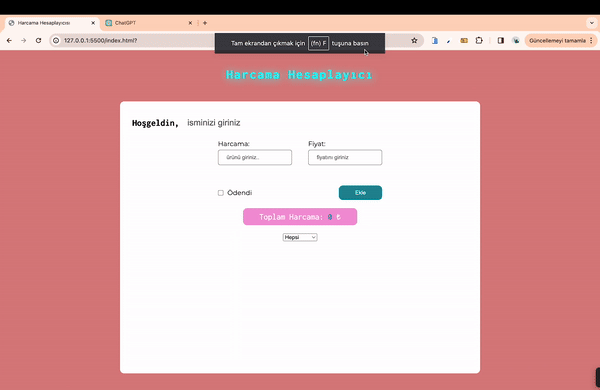

<h1> Expense Calculator </h1>

This project represents an expense tracking application created using the JavaScript programming language. Users can use this app to track their expenses and manage their budget.

<h2> The technologies used in the project </h2>

It was coded using HTML,CSS and JavaScprit technologies.

<h2> Demo </h2>

You can view a live demo of this project [here] (https://seliinatmaca.github.io/expensecalculator/)

<h2> screenshot </h2>

# expensecalculator
